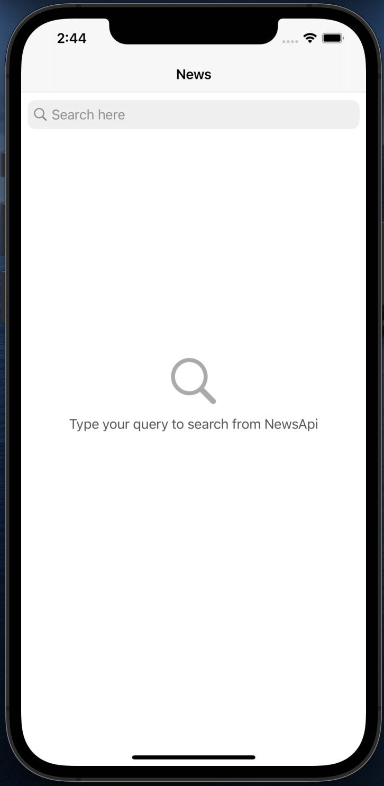
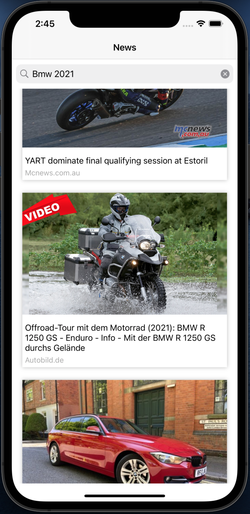
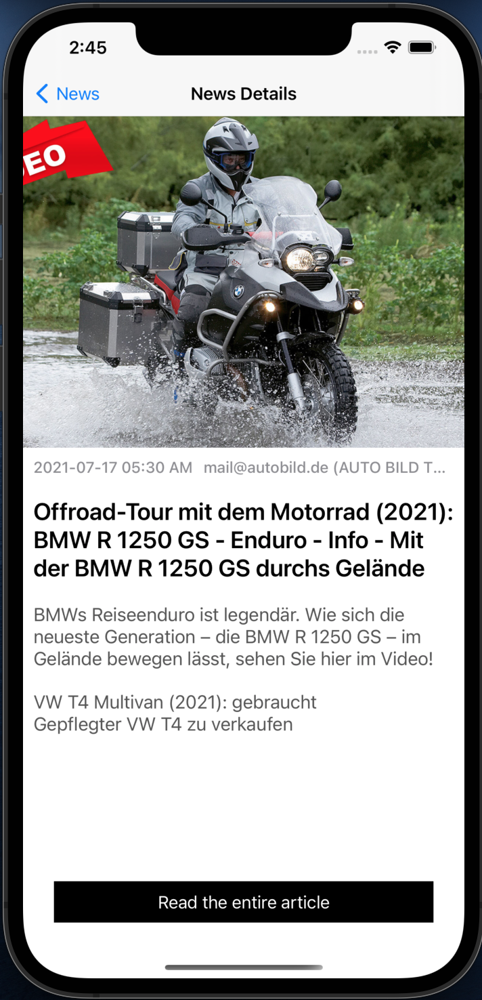

# asgaTask

Hey ! This is an ios task. 
It's a news app with simple user interface ! App architecture is MVP.  

# Architecture
I preferred MVP for this project because its more testable and maintainable than MVC.  

## 3rd Party Libraries
-[Alamofire](https://github.com/Alamofire/Alamofire)  
-[SDWebImage](https://github.com/SDWebImage/SDWebImage)  

# Features
-Pagination  
-Programmatically UI  

## Usage
It is powered by [NewsAPI](https://newsapi.org) .

# ScreenShots

